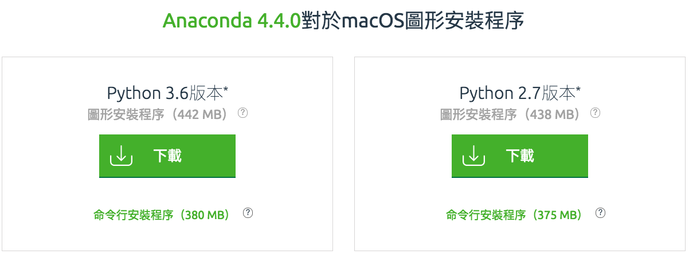
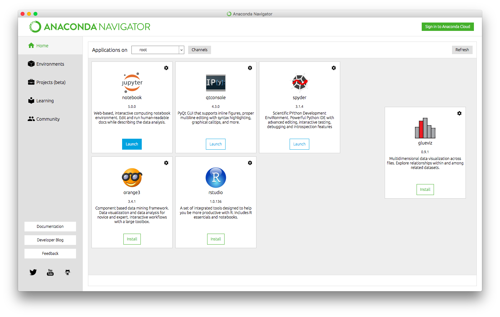
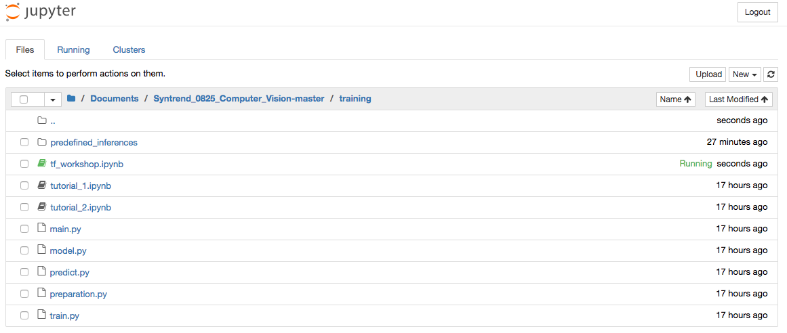
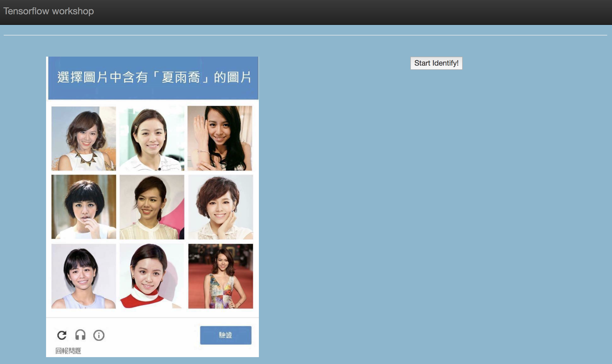
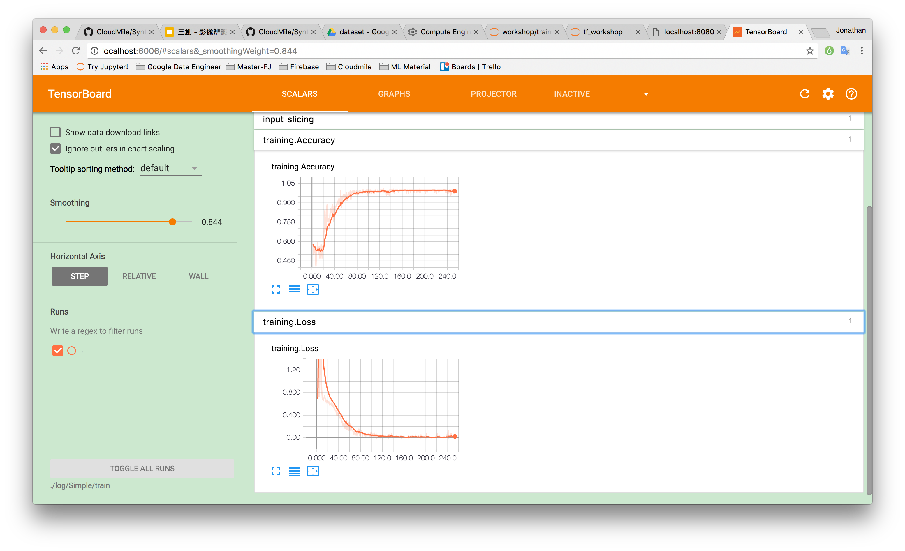

# Syntrend Computer Vision Workshop

Installing required Python libraries

1. Download and Install Anaconda at https://www.continuum.io/downloads
	- install with Python 3.x



2. After install anaconda, run the following commands in terminal or command line

```shell
$ pip install tensorflow
$ pip install pillow
$ pip install opencv-python
```

3. check you install the most recent tensorflow version

```shell
pip list | grep tensorflow
```
	- if not 1.3, either upgrade or reinstall tensorflow with pip command in previous step


Getting source code 
```shell
$ git clone https://github.com/CloudMile/Syntrend_0825_Computer_Vision.git
$ cd Syntrend_0825_Computer_Vision-master
```
# Run Training and predicting through anaconda 

Open jupyter 


Navigate to directory clone/downloaded from previouse step


# Run Predicting with Web-UI (After successful training)

```shell
$ cd Syntrend_0825_Computer_Vision-master/gui
$ python application.py
```



# Run Training and predicting with commmand line

For Training:

```shell
$ cd ./training
$ python main.py --do_training=True
```

For Predicting:
```shell
$ cd ./training
$ python main.py
```

Optional arguments:

```shell
--do_training: Whether to do training or predicting, False to do predict. default: False

--dataset_dir: Directory of training dataset. default: ‘../dataset/cropped’

--logging_dir: Directory of logs (models). default: ‘../log’

--dataset_dir: Directory of predicting files. default: ‘../dataset/predicting/cropped’

--model_name: Predefined models: Simple, Custom, Resnet_v1, Resnet_v2, or cifar10. default: ‘Simple’

--image_format: Image format (png or jpg). default: ‘png’

--image_size: Image size (height, width) in pixels. default: 200

--margin: Margin for the crop around the bounding box (height, width) in pixels. default: 44

--max_step: Maximum training steps. default: 400
```

# Run Tensorboard to see you training
```shell
$ cd Syntrend_0825_Computer_Vision-master
$ tensorboard --logdir=./log/Simple/train
```


